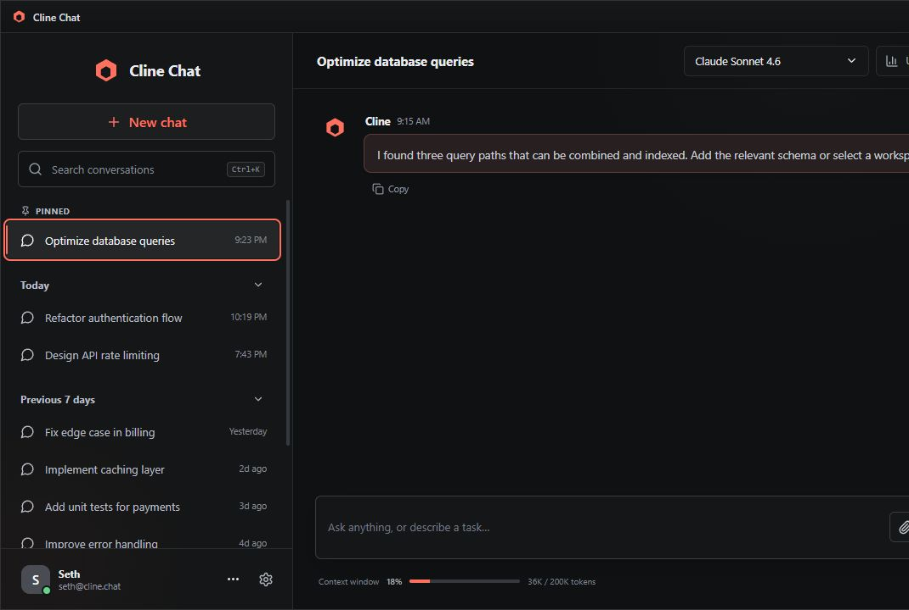
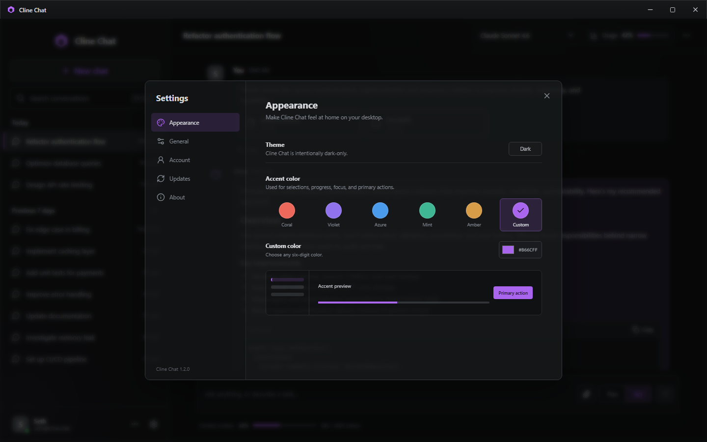
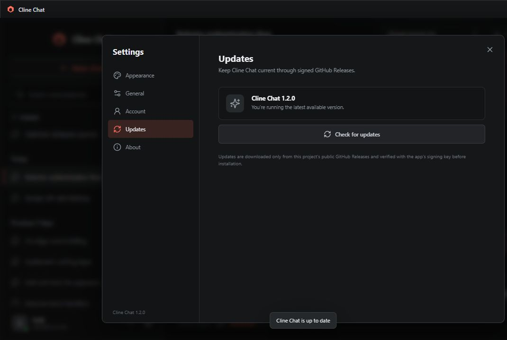

# Cline Chat for Windows

A polished, dark-only Windows desktop client for chatting with the models available through your Cline account.

> [!IMPORTANT]
> **Cline Chat is an independent, unofficial open-source project.** It is not created, maintained, sponsored, authorized, or endorsed by [Cline](https://cline.bot/) or Cline Bot Inc. The Cline name is used only to describe compatibility with Cline accounts, services, and the open-source Cline SDK.



*A full conversation workspace with model selection, live usage, pinned history, Markdown responses, code blocks, context controls, and Plan/Act modes.*

## Download

Cline Chat is available for **Windows 10 or 11 on x64 PCs**.

1. Open the [latest GitHub release](https://github.com/sethrickert/cline-app/releases/latest).
2. Download the `.exe` installer for the simplest setup, or the `.msi` package for managed Windows environments.
3. Install Cline Chat and sign in through the browser when prompted.

The installer includes the local Cline service; users do not need to install Node.js, Bun, Rust, the Cline CLI, or a separate Windows service. Microsoft Edge WebView2 is installed automatically when it is missing.

> [!NOTE]
> Release updates are cryptographically signed for the in-app updater. The Windows installers are not currently Authenticode-signed, so Windows may identify the publisher as unknown or show a SmartScreen prompt.

## Features

### Chat and models

- Sign in to a Cline account using the system browser, with the device code displayed inside the app
- Load the models available to the signed-in account instead of showing a hard-coded catalog
- Browse a scrollable model menu with additive Favorites, Recommended, All Models, and Free Models sections
- Mark favorites without removing them from the complete model catalog
- Show consistent FREE and Recommended badges plus the account plan, context size, and vision support returned by Cline
- Stream structured Markdown responses without exposing raw SDK event data
- Display an animated **Thinking** state, response progress, completion time, and recoverable errors
- Switch between Plan and Act modes for each conversation
- Stop an active response, copy or share individual answers, and copy code blocks

### Context and attachments

- Add files or folders from the context menu
- Drag files into the composer without duplicate attachments
- Paste images directly from the Windows clipboard
- Send image data to vision-capable models
- Extract readable content from PDF and Word documents
- Attach Markdown, text, CSV, JSON, source code, and other plain-text formats
- See the current context-window size and token usage while composing

### Conversations and personalization

- Browse searchable conversation history grouped by date
- Pin important conversations above the rest of the history
- Rename, share, or delete a conversation from its context menu
- Render user and Cline messages as separate, copyable cards
- Upload a profile picture or use an HTTPS image URL, then position and zoom it in a circular crop tool
- Preserve transparent profile images and use a white initials avatar by default
- Use an intentionally dark-only interface with native Windows window controls
- Use Pacific (`#1CA9C9`) by default; choose Coral, Violet, Azure, Mint, or Amber, or enter any valid six-digit color
- Configure Enter-to-send, timestamps, and automatic update checks

### Account, usage, and updates

- View available Cline account, plan, organization, and credit information when returned by the service
- Inspect input tokens, output tokens, estimated cost, and context usage for the current conversation
- Check GitHub Releases for updates from Settings
- Automatically check for updates when the app starts
- Download, verify, and install signed updates without leaving the app

## Appearance



*Appearance settings offer Pacific plus five alternate presets, a validated custom six-digit color field, and a live preview. The selected accent is saved locally and applied to selections, progress indicators, focus states, and primary actions.*

## Updates



*The Updates page shows the installed version and checks this repository's public GitHub Releases. Downloads are verified with the updater signing key embedded in Cline Chat before installation begins.*

## How it works

Cline Chat uses the official [`@cline/sdk`](https://github.com/cline/cline/tree/main/sdk) rather than installing or parsing the Cline CLI. The SDK provides structured authentication, model discovery, sessions, streaming events, history, and usage information that map cleanly to a graphical application.

```text
React interface inside Tauri WebView2
                 │
        authenticated localhost WebSocket
                 │
 bundled Bun sidecar using @cline/sdk / ClineCore
                 │
       Cline account, models, and providers
```

- **Desktop shell:** Tauri 2, packaged only for Windows x64.
- **Interface:** React 19, TypeScript, and a custom dark design system.
- **Local service:** A compiled Bun sidecar using `@cline/sdk` and `ClineCore`.
- **Process security:** The sidecar listens only on `127.0.0.1` and requires a random token generated for each app launch.
- **Process lifetime:** The sidecar runs without a visible console and stops when Cline Chat closes. It is not installed as a machine-wide service and does not require administrator access.
- **Safety boundary:** This chat-focused client does not enable autonomous SDK tool execution. User-selected attachments are supplied as model context.

See [Architecture and integration notes](docs/ARCHITECTURE.md) for implementation details.

## Local data and Cline services

- Cline credentials, provider settings, and sessions use storage managed by the Cline SDK.
- Appearance preferences, chat preferences, favorite models, pinned conversations, and optional profile-picture crop settings are stored in the local WebView profile.
- Profile-picture changes in Cline Chat do not modify the user's Cline account.
- Attachments are read from the user's chosen local paths and are not copied into this repository.
- When a user signs in to or uses Cline's hosted services, that service remains governed by [Cline's Terms of Service](https://cline.bot/tos) and [Privacy Notice](https://cline.bot/privacy).

## Keyboard shortcuts

| Shortcut | Action |
| --- | --- |
| `Ctrl+S` | Focus conversation search |
| `Ctrl+,` | Open Settings |
| `Enter` | Send a message when Enter-to-send is enabled |
| `Shift+Enter` | Insert a new line |
| `Esc` | Close the active menu or dialog |

## Contributing

Contributions are welcome. Start with the [contribution guide](CONTRIBUTING.md), then open a focused issue or pull request.

- Every pull request is automatically assigned to the repository owner for review.
- Changes must pass the Windows verification workflow before they can merge.
- Outside contributors cannot push directly to `main`.
- Review conversations must be resolved and approved changes are squash-merged.
- Vulnerabilities should be submitted privately through the repository's **Security** tab.

## Development

### Requirements

- Windows 10 or 11, x64
- Node.js 22 or newer
- pnpm 11
- Rust stable with the MSVC toolchain
- Microsoft Edge WebView2 Runtime

### Run the browser preview

```powershell
pnpm install
pnpm dev
```

The browser preview uses representative local conversations so the interface can be reviewed without connecting a Cline account.

### Run the Windows desktop app

```powershell
pnpm dev:desktop
```

### Verify and package

```powershell
pnpm check
pnpm run audit
pnpm build:sidecar
pnpm exec tauri build
```

The final command creates NSIS and MSI installers under `src-tauri/target/release/bundle`.

## Releases and automatic updates

The Windows verification workflow checks every push and pull request. It type-checks, tests, audits, builds the interface and sidecar, and packages both Windows installers.

Pushing a matching `v*` tag runs the release workflow, which publishes installers, updater signatures, and `latest.json` to GitHub Releases. The app checks the stable endpoint below:

```text
https://github.com/sethrickert/cline-app/releases/latest/download/latest.json
```

Maintainers must keep the updater private key secure and bump the version in `package.json`, `src-tauri/Cargo.toml`, and `src-tauri/tauri.conf.json` before publishing a new tag. Losing the updater key prevents existing installations from accepting future updates.

## Project status

Version **1.2.0** is the first public Windows release. Automated tests, Windows packaging, signed in-app updates, and public release artifacts are active. The main remaining distribution improvement is Windows Authenticode signing to provide verified publisher identity and reduce SmartScreen friction.

## License, attribution, and trademarks

Cline Chat is free software distributed under the [MIT License](LICENSE). It was created by [Seth Rickert](https://github.com/sethrickert) with development assistance from OpenAI Codex. Source code, release history, and issue tracking are available in this repository.

The [Cline project and SDK](https://github.com/cline/cline) are separate open-source works distributed under the Apache License 2.0 and maintained by Cline Bot Inc. See [Third-party notices](THIRD_PARTY_NOTICES.md) for attribution.

**Cline Chat is not an official Cline product and has no corporate relationship with Cline Bot Inc.** “Cline,” its logos, and related marks belong to their respective owners. Their appearance or mention here does not imply affiliation or endorsement. Visit the [official Cline website](https://cline.bot/), [Cline GitHub organization](https://github.com/cline), and [Cline brand guidelines](https://cline.bot/brand) for the official project and brand materials.
